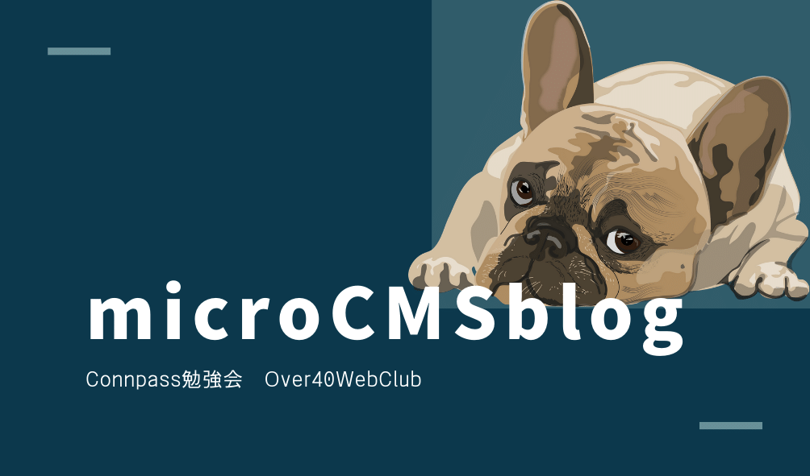

<!-- AUTO-GENERATED-CONTENT:START (STARTER) -->
<p align="center">
  <a href="https://over40webclub.connpass.com/event/212129/">
    
  </a>
</p>
<h1 align="center">
  Gatsby-microCMS Blog starter
</h1>

このスターターは、Gatsby-microCMSを連携したブログを構築できます。
デザインは、startBootstrapからCleanBlogというテンプレートを使っています。

## 🚀 Quick start

1.  **新しいGatsbyサイトを作る**

    GatsbyCLIで新しいプロジェクトを開始します。シェルで以下のコマンドを実行します。

    ```shell
    # create a new Gatsby site using the Gatsby-microCMS Blog starter

    gatsby new my-blog https://github.com/sonho463/starter-microcms-gc.git

    ```

2.  **GatsbyとmicroCMSを接続する設定**

    1. コードエディタでプロジェクトを開きます。
    2. ルートフォルダに`.env.development` `.env.production`ファイルを作成
    3. それぞれのファイルに、以下の内容を記述

			```
			MICROCMS_API_KEY = "Your API-KEY"
			MICROCMS_SERVICE_ID = "Your ServiceID"
			```
3. **microCMSのデータベースを準備**
   1. ３つのAPIを作成。
		|API    |形式    |エンドポイント|
		|-------|-------|------------|
		|記事API|リスト形式|posts      |
		|カテゴリAPI|リスト形式|category |
		|設定API|オブジェクト形式|config |
	2. 記事APIとカテゴリAPIのschemaをインポート
       - /microcmsSampleFiles/microcmsSchemaフォルダ内
	3. コンテンツもCSVからインポート
         - 直接データを入力してもOK
	4. microCMSのデータは次のことに注意
      	1. 記事データは２つ、カテゴリデータは１つ以上のデータをいれておく
      	2. １つ以上の記事データのアイキャッチ画像とauthorフィールドは空にしない

4.  **開発サーバーと本番確認サーバーで表示**
    1.  gatsby develop
        1.  localhost:8000で表示されます。
    2.  gatsby build -> gatsby serve
        1.  localhost:9000で表示されます。

    